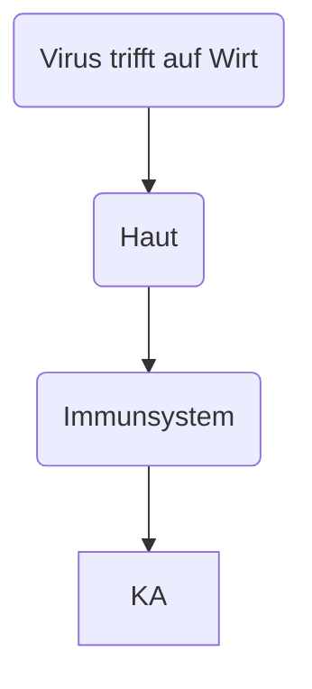

# Die Immunabwehr des Koerpers

- *Rote* / *Weisse* Blutkoerperchen

## S. 119 Aufgabe 3

Auch bei den 

## C Die Rolle der MHC-Molekuele bei der Immunantwort

- S. 122 lesen
- S. 121: Bild 2
- A1 a-d
- S. 123
